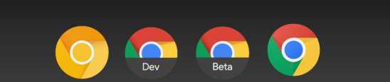
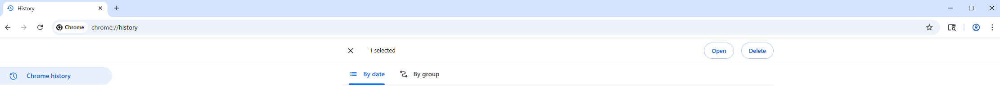
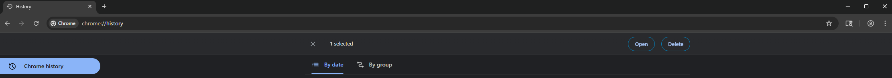
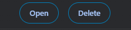

# Open Button

## What is this?
The Open Button is an open-source contribution to Google’s Chromium project. It adds a button to chrome://history that lets users reopen multiple closed tabs with a single click.

## Usage

This feature is currently available across the following Chrome channels:

  &emsp;Canary – version 140.0.7339.2 (released August 5, 2025)

  &emsp;Dev – version 140.0.7327.6 (released July 31, 2025)

  &emsp;Beta – version 140.0.7339.16 (released August 13, 2025)

  &emsp;Stable – version [insert version] (released [insert date])

For usage within Chromium, check out the official [Chromium Documentation](https://chromium.googlesource.com/chromium/src/+/main/docs/README.md).

## Screenshots

## License
This program is free software: you can redistribute it and/or modify it under the terms of the license.

It’s also available to browse in [Chromium’s Code Search](https://source.chromium.org/). 

## Thanks
I want to thank the project's code reviewers. This wouldn't be nearly as solid without the months you spent making sure every detail was right. You know who you are.

Also, a big thanks to everyone who helped me keep this project moving forward. You know who you are, too.

